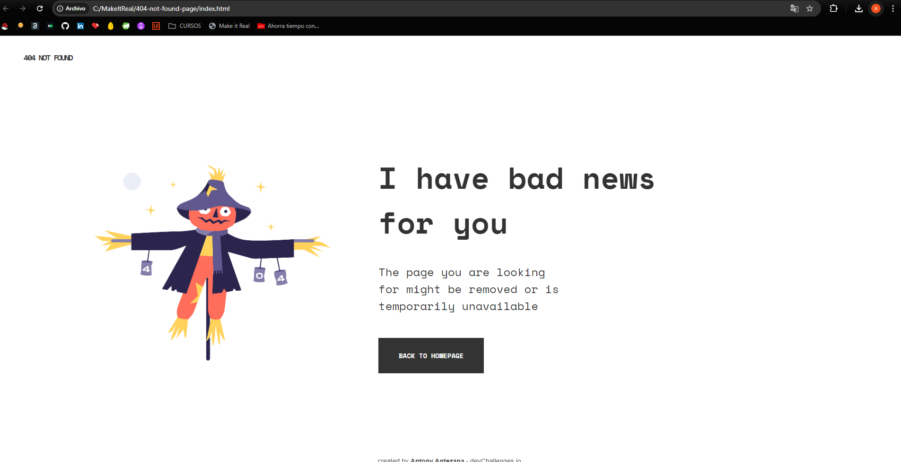

# Make It Real - NAME OF THE PROJECT

This is a solution to the "404 not found page" project of the Make It Real course.

## Table of contents

- [Overview](#overview)
  - [The challenge](#the-challenge)
  - [Screenshot](#screenshot)
- [My process](#my-process)
  - [Built with](#built-with)
  - [What I learned](#what-i-learned)
  - [Continued development](#continued-development)
  - [Useful resources](#useful-resources)
- [Author](#author)
- [Acknowledgments](#acknowledgments)

## Overview

### The challenge

Users should be able to:
Users will be able to view a 404 page.

### Screenshot



## My process

### Built with

- Semantic HTML5 markup
- CSS custom properties
- Flexbox
- Mobile-first workflow

### What I learned

Use this section to recap over some of your major learnings while working through this project. Writing these out and providing code samples of areas you want to highlight is a great way to reinforce your own knowledge.

To see how you can add code snippets, see below:

```html

```

```css
@media screen and (max-width: 1200px) {
  .img-container {
    width: 600px;
  }

### Continued development

For future projects, I will focus on image optimization to ensure fast loading times. I'll also explore more about implementing CSS to improve the user experience.

### Useful resources

- [resource 1](https://fonts.googleapis.com/css2?family=Space+Mono:ital,wght@0,400;0,700;1,400;1,700&display=swap) - This helped me with the font style reason.

## Author

- Website - [Antony Antezana](https://github.com/Akuma2522)


## Acknowledgments

I am grateful to the teachers and the authors of the visual and written internet resources.
```
